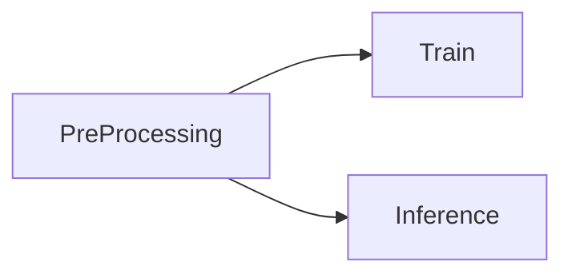
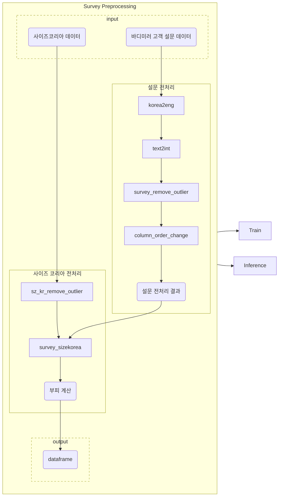
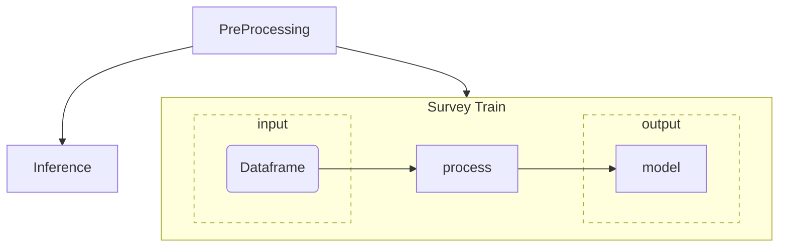
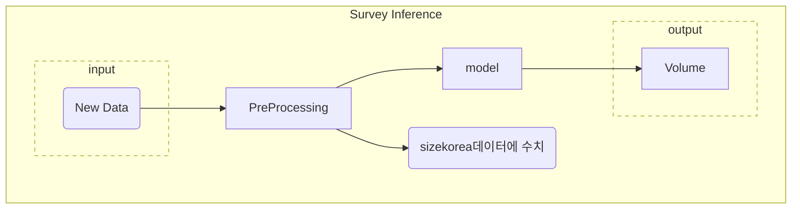

  <h1 align="center">Diagram : Antigravity Volume Estimation</h1>

#### [Antigravity Bitbucket : FIT-AI-VOLUME](https://bitbucket.org/antigravity_dev/fit-ai-volume/src/master/)
---

---
main_GT.py
---
전체 프로세스 흐름도
main_GT.py

---
Image, Depth(G.T.) 로드 순서  
main.py 

---

- Survey Train

---
Survey Inference

